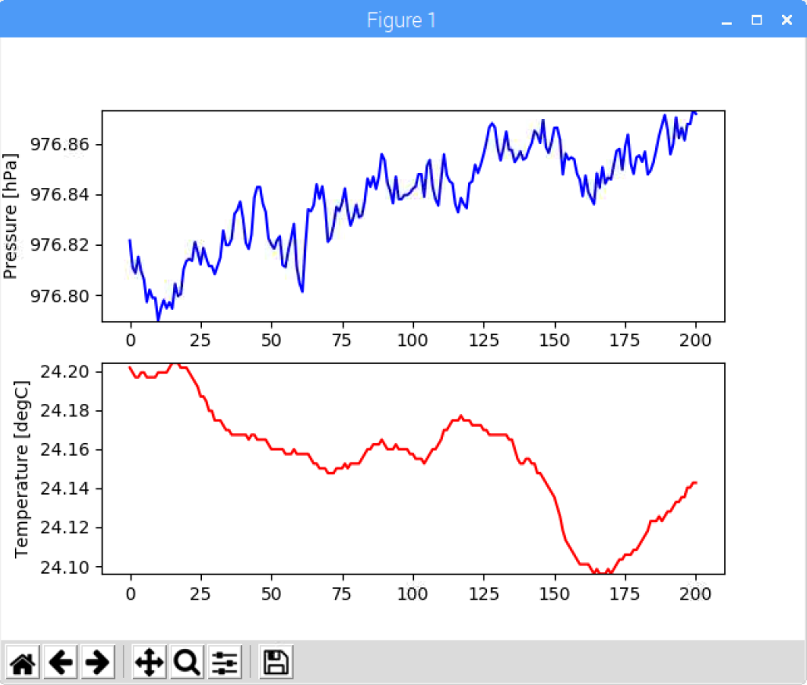

# Python BMP280 library

---
This Python library enables the control for the BMP280 barometric pressure sensor form a Raspberry Pi 3.
Data can be read directly form the registers and converted into temperature and pressure values. Also control and configuration registers can be written to change the operating mode of the sensor.

---

## Installation
You can either clone the repository directly from [Github](https://github.com/akcarsten/BMP280) or run the following command(s) in your terminal:

Pip Installation:
```
```

Alternatively you can clone the Git repository:

```
git clone https://github.com/akcarsten/BMP280.git
```
Then go to the folder to which you cloned the repository and run:

```
python setup.py install
```
Now you can run Python and import the BMP280 library.

## Introduction

##### 1. Writing registers
&nbsp;write_register(register, int_value)

###### &nbsp;&nbsp;&nbsp;register:

###### &nbsp;&nbsp;&nbsp;int_value:

&nbsp;set_config()

&nbsp;set_control()

##### 2. Reading registers
&nbsp;read_register(register, num_bytes)

###### &nbsp;&nbsp;&nbsp;register:

###### &nbsp;&nbsp;&nbsp;num_bytes:

&nbsp;read_config_register()

&nbsp;read_control_register()

&nbsp;read_status_register()

&nbsp;read_calibration()

&nbsp;read_data()

##### 3. Reading temperature and pressure coefficients
&nbsp;get_temperature_coefficients()

&nbsp;get_pressure_coefficients()

##### 4. Converting ADC values
&nbsp;get_adc()

&nbsp;convert_adct(adc_t, temp_coeffs)
###### &nbsp;&nbsp;&nbsp;adc_t:

###### &nbsp;&nbsp;&nbsp;temp_coeffs:

&nbsp;convert_adcp(adc_p, adc_t, pres_coeffs, temp_coeffs)
###### &nbsp;&nbsp;&nbsp;adc_p:

###### &nbsp;&nbsp;&nbsp;adc_t:

###### &nbsp;&nbsp;&nbsp;pres_coeffs:

###### &nbsp;&nbsp;&nbsp;temp_coeffs:

##### 5. Retrieving pressure and temperature data
&nbsp;get_data()

## Example for data collection and visualization

This repository contains an example python script which shows some of the BMP280 features.
It can be executed directly from the terminal
```
python example.py
```


## Example for data logging
